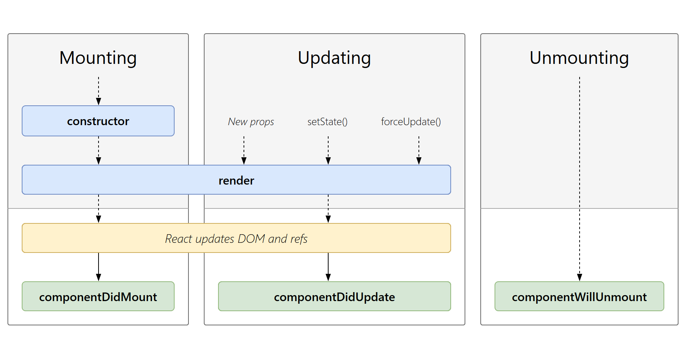

# React Class Component Life Cycle

============================== Life Cycle =======================================

## Mounting:

1. `constructor()`
2. `static getDerivedStateFromProps()`
3. `render()`
4. `componentDidMount()`

## Updating:

1. `static getDerivedStateFromProps()`
2. `shouldComponentUpdate()`
3. `render()`
4. `getSnapshotBeforeUpdate()`
5. `componentDidUpdate()`

## Unmounting:

1. `componentWillUnmount()`

## Error Handling:

1. `static getDerivedStateFromError()`
2. `componentDidCatch()`

=====================================================================================

### 🌱 1. Mounting (Gắn vào DOM) – Khi component được tạo và hiển thị lần đầu

Khi component được khởi tạo và gắn vào DOM, React sẽ gọi các phương thức theo thứ tự sau:

#### `constructor()`

- Khởi tạo state và bind các phương thức.
- **Ví dụ:**

```javascript
constructor(props) {
  super(props)
  this.state = { count: 0 }
}
```

- Chỉ chạy 1 lần khi component được tạo.

#### `static getDerivedStateFromProps(props, state)`

- Cập nhật state dựa trên props (không thường xuyên dùng).
- Chạy trước `render()`.
- Trả về object để cập nhật state hoặc `null` nếu không cần cập nhật.
- **Ví dụ:**

```javascript
static getDerivedStateFromProps(props, state) {
  if (props.value !== state.value) {
    return { value: props.value }
  }
  return null
}
```

#### `render()`

- Tạo giao diện (UI) dựa trên state và props.
- Phương thức duy nhất bắt buộc phải có trong component.
- **Ví dụ:**

```javascript
render() {
  return <h1>{this.state.count}</h1>
}
```

#### `componentDidMount()`

- Được gọi ngay sau khi component được gắn vào DOM.
- Thích hợp để:
  - Gọi API
  - Thiết lập `setInterval`, `setTimeout`
  - Tương tác trực tiếp với DOM
- **Ví dụ:**

```javascript
componentDidMount() {
  this.timer = setInterval(() => {
    this.setState({ count: this.state.count + 1 })
  }, 1000)
}
```

---

### 🔄 2. Updating (Cập nhật) – Khi component thay đổi do state hoặc props

Component sẽ cập nhật khi:

- Props thay đổi từ cha truyền vào.
- State thay đổi bên trong component thông qua `setState()`.

Các phương thức được gọi trong quá trình cập nhật:

#### `static getDerivedStateFromProps(props, state)`

- (Tương tự như lúc mounting)

#### `shouldComponentUpdate(nextProps, nextState)`

- Kiểm soát việc component có cần re-render hay không.
- Mặc định: return `true` (luôn luôn re-render).
- Trả về `false` nếu không muốn cập nhật.
- **Ví dụ:**

```javascript
shouldComponentUpdate(nextProps, nextState) {
  return nextState.count !== this.state.count
}
```

#### `render()`

- Tạo lại giao diện mỗi khi state hoặc props thay đổi.

#### `getSnapshotBeforeUpdate(prevProps, prevState)`

- Chạy ngay trước khi DOM cập nhật, trả về giá trị để sử dụng trong `componentDidUpdate()`.
- **Ví dụ:**

```javascript
getSnapshotBeforeUpdate(prevProps, prevState) {
  return document.getElementById('scroll-box').scrollHeight
}
```

#### `componentDidUpdate(prevProps, prevState, snapshot)`

- Chạy ngay sau khi component cập nhật xong.
- Thích hợp để:
  - Gọi API dựa vào state mới
  - Tương tác với DOM khi đã render xong
- **Ví dụ:**

```javascript
componentDidUpdate(prevProps, prevState) {
  if (prevState.count !== this.state.count) {
    console.log('Count has changed!')
  }
}
```

---

### 🌅 3. Unmounting (Gỡ bỏ khỏi DOM) – Khi component bị xóa

Khi component bị xóa khỏi DOM, React sẽ gọi:

#### `componentWillUnmount()`

- Dọn dẹp tài nguyên (clearInterval, hủy kết nối WebSocket, gỡ bỏ event listener).
- **Ví dụ:**

```javascript
componentWillUnmount() {
  clearInterval(this.timer)
}
```

---


